# 📊 Comprehensive EDA Project Report: Hotel Booking Demand Analysis

> **Thiranex Data Science Internship — Task 3 Formal Deliverable**  
> **Author:** Sanjai B  
> **Role:** Data Science Intern  
> **Project Title:** Exploratory Data Analysis & Analytical Reasoning on Hotel Booking Demand  
> **Dataset:** Kaggle Hotel Booking Demand (`hotel_booking.csv` — 119,390 records, 32 attributes)  
> **Associated Notebook:** [`Hotel_Booking_Demand_EDA.ipynb`](Hotel_Booking_Demand_EDA.ipynb)  
> **Repository Documentation:** [`README.md`](README.md)  

---

## Executive Summary

Hotel booking cancellations, volatile demand seasonality, and unpredictable guest behaviors pose persistent challenges to hospitality revenue management and operational planning. This report delivers an in-depth exploratory data analysis (EDA) of **119,390 real-world hotel booking records** from two contrasting properties: **City Hotel** and **Resort Hotel** properties represented in the Hotel Booking Demand dataset, collected across a 26-month observation period from July 2015 to August 2017.

Moving beyond surface-level descriptive cleaning, this report applies **analytical reasoning** to uncover the core economic, operational, and behavioral drivers governing booking cancellations, pricing elasticity (Average Daily Rate — ADR), geographic feeder markets, and customer micro-commitments.

---

## Table of Contents
1. [Introduction](#1-introduction)
2. [Objective](#2-objective)
3. [Dataset Description](#3-dataset-description)
4. [Data Understanding](#4-data-understanding)
5. [Statistical Analysis](#5-statistical-analysis)
6. [Univariate Analysis](#6-univariate-analysis)
7. [Bivariate Analysis](#7-bivariate-analysis)
8. [Correlation Analysis](#8-correlation-analysis)
9. [Outlier Analysis](#9-outlier-analysis)
10. [Major Patterns and Trends](#10-major-patterns-and-trends)
11. [Key Insights](#11-key-insights)
12. [Conclusion](#12-conclusion)
13. [Future Scope](#13-future-scope)

---

## 1. Introduction

The hospitality industry operates under high fixed costs and perishable inventory: an unsold room night represents revenue lost permanently. Simultaneously, unexpected booking cancellations compromise capacity forecasting, disrupt food and beverage procurement, lead to inefficient housekeeping schedules, and directly depress **Revenue per Available Room (RevPAR)**.

Modern hotel revenue managers must anticipate not only *when* bookings will occur, but *which* reservations will translate into actual arrivals. This study explores booking characteristics from hotel reservation databases to quantify the behavioral mechanisms behind cancellations, seasonal price surges, and market segmentation.

---

## 2. Objective

The primary objective of this project is to conduct a structured, hypothesis-driven exploratory data analysis on the Hotel Booking Demand dataset to extract actionable business intelligence.

Specifically, the study aims to answer the following research questions:
1. **Property Dynamics:** Which property type experiences greater demand, and how do their cancellation profiles diverge?
2. **Temporal Fluctuations:** How does reservation volume vary by month and calendar season?
3. **Geographic Distribution:** Which domestic and international markets constitute the primary revenue base?
4. **Length of Stay:** What are the characteristic stay durations across weekday and weekend periods?
5. **Lead Time Sensitivity:** How does advance booking horizon correlate with cancellation probability?
6. **Cancellation Determinants:** Which commercial, operational, and customer variables exhibit the strongest statistical associations with cancellations?
7. **Pricing Elasticity (ADR):** How do Average Daily Rates fluctuate between property types across seasonal cycles?
8. **Micro-Commitment Signals:** Can low-friction customer actions (e.g., parking space requests, special requests) serve as reliable leading indicators of arrival?
9. **Strategic Prescriptions:** How can hotel managers leverage these analytical findings to optimize overbooking thresholds, refine deposit policies, and stimulate direct channel loyalty?

---

## 3. Dataset Description

The dataset was curated by Antonio, de Almeida, and Nunes (2019) and hosted on Kaggle as *Hotel Booking Demand*. It documents **119,390 hotel booking transactions** spanning from July 1, 2015 to August 31, 2017.

### Summary Characteristics
* **Total Records:** 119,390 rows
* **Total Attributes:** 32 columns (expanded to 36 through feature engineering)
* **Property Types:** City Hotel (urban Lisbon) and Resort Hotel (Algarve coastal resort)
* **Temporal Coverage:** 26 continuous calendar months
* **Granularity:** Individual reservation level

### Primary Feature Categories

| Feature Category | Attributes | Business Significance |
|---|---|---|
| **Target Variable** | `is_canceled` | Binary flag (`0` = Check-Out, `1` = Canceled) indicating final status |
| **Property Details** | `hotel` | Classification of property: City Hotel vs. Resort Hotel |
| **Temporal Identifiers** | `lead_time`, `arrival_date_year`, `arrival_date_month`, `arrival_date_week_number`, `arrival_date_day_of_month` | Reservation horizon and arrival timing across calendar periods |
| **Stay Characteristics** | `stays_in_weekend_nights`, `stays_in_week_nights`, `total_stay` (engineered) | Breakdown of length of stay across business vs leisure nights |
| **Guest Demographics** | `adults`, `children`, `babies`, `total_guests` (engineered), `country` | Composition of the travel party and geographic origin |
| **Commercial Channels** | `meal`, `market_segment`, `distribution_channel`, `agent`, `company` | Commercial packaging, booking intermediaries, and agency relationships |
| **Customer Behavior & History** | `is_repeated_guest`, `previous_cancellations`, `previous_bookings_not_canceled`, `booking_changes`, `deposit_type`, `days_in_waiting_list`, `customer_type`, `required_car_parking_spaces`, `total_of_special_requests` | Loyalty status, cancellation precedent, contract policies, and engagement markers |
| **Financial Metric** | `adr` | Average Daily Rate (total room revenue divided by total stay nights in €) |
| **Operational Tracking** | `reserved_room_type`, `assigned_room_type`, `reservation_status`, `reservation_status_date` | Room allocation discrepancies and final administrative settlement date |

---

## 4. Data Understanding

A comprehensive structural audit was conducted to evaluate data hygiene, missingness, duplicate transactions, and domain-specific anomalies.

### 4.1 Missing Value Diagnostics & Handling Strategy
Four columns contained missing entries:

| Column | Missing Records | Missing Percentage | Imputation Strategy & Domain Justification |
|---|---|---|---|
| `company` | 112,593 | 94.31% | Imputed with `0`. In hospitality systems, missing corporate ID indicates non-corporate private individual bookings. |
| `agent` | 16,340 | 13.69% | Imputed with `0`. Missing agent ID indicates direct customer booking without travel agency intervention. |
| `country` | 488 | 0.41% | Imputed with `'Unknown'`. Preserves valid values across all other 31 attributes. |
| `children` | 4 | <0.01% | Imputed with `0` (mode/logical default: adult-only party). |

### 4.2 Duplicate Transaction Analysis
* **Identified Duplicates:** 31,994 records (26.8% of the raw dataset).
* **Domain Context & Retention Rationale:** In hotel reservation databases, identical rows routinely emerge from legitimate operational scenarios such as tour operators booking identical room blocks for tour groups, corporate coordinators reserving multiple rooms under identical credentials, or multi-room family reservations. Duplicate records were identified but retained in the primary analytical dataset because duplicate reservations can represent repeated records in the source dataset or genuine group/multi-room bookings; their presence is documented and sensitivity to duplication is considered when interpreting aggregate counts. We do not claim duplicates were removed.

### 4.3 Logical Consistency & Boundary Audits
* **Zero-Guest Reservations:** 180 records possessed 0 adults, 0 children, and 0 babies. These represent administrative testing errors or invalid reservations and were excluded from the analytical baseline.
* **Zero-Night Stays:** 715 records recorded 0 weekend nights and 0 weekday nights (day-use reservations or instant cancellations).
* **Invalid / Extreme ADR:** 1 record recorded a negative ADR of `-€6.38` (accounting credit/refund adjustment), and 1 record recorded an extreme value of `€5,400.00` (data entry anomaly). Both violate the domain validity boundary `0 <= adr <= 1000`.
* **Analytical Clean Subset:** Filtered consistently to 119,208 records satisfying `total_guests > 0` and `0 <= adr <= 1000`.

---

## 5. Statistical Analysis

Descriptive statistics were computed across all primary continuous and discrete numerical variables to evaluate central tendency, dispersion, skewness, and kurtosis.

### Parametric and Non-Parametric Metric Summary

| Variable | Mean | Std Dev | Min | 25% (Q1) | Median (Q2) | 75% (Q3) | Max | IQR | Skewness | Kurtosis |
|---|---|---|---|---|---|---|---|---|---|---|
| `lead_time` | 104.01 | 106.86 | 0 | 18.0 | 69.0 | 160.0 | 737 | 142.0 | +1.34 | +1.08 |
| `total_stay` | 3.43 | 2.56 | 0 | 2.0 | 3.0 | 4.0 | 69 | 2.0 | +2.86 | +27.24 |
| `stays_in_week_nights` | 2.50 | 1.91 | 0 | 1.0 | 2.0 | 3.0 | 50 | 2.0 | +2.36 | +24.11 |
| `stays_in_weekend_nights` | 0.93 | 1.00 | 0 | 0.0 | 1.0 | 2.0 | 19 | 2.0 | +1.38 | +7.17 |
| `adults` | 1.86 | 0.58 | 0 | 2.0 | 2.0 | 2.0 | 55 | 0.0 | +18.31 | +1352.2 |
| `children` | 0.10 | 0.40 | 0 | 0.0 | 0.0 | 0.0 | 10 | 0.0 | +4.11 | +18.63 |
| `adr` (€) | 101.80 | 48.06 | 0.0 | 69.3 | 94.6 | 126.0 | 508 | 56.7 | +1.05 | +3.54 |
| `booking_changes` | 0.22 | 0.65 | 0 | 0.0 | 0.0 | 0.0 | 21 | 0.0 | +6.43 | +79.25 |
| `days_in_waiting_list` | 2.32 | 17.59 | 0 | 0.0 | 0.0 | 0.0 | 391 | 0.0 | +3.13 | +67.58 |
| `total_of_special_requests` | 0.57 | 0.79 | 0 | 0.0 | 0.0 | 1.0 | 5 | 1.0 | +1.53 | +1.50 |

### Statistical Deductions:
1. **Lead Time Dispersion:** The large gap between median (69 days) and mean (104 days) combined with positive skewness (+1.34) confirms that while half of reservations are made within ~2.3 months, a substantial long-tail books over 1 to 2 years in advance.
2. **Stay Duration Concentration:** The interquartile range (IQR) for `total_stay` is narrow (2 to 4 nights), demonstrating that hotel capacity is overwhelmingly occupied by short-to-medium duration guests.
3. **Price Stability Range:** 50% of all room nights are sold within a tight price band between €69.30 and €126.00, though maximum peak rates reach €508.00 in resort luxury suites.

---

## 6. Univariate Analysis

Univariate analysis explores single-variable properties to quantify market share, overall cancellation incidence, demographic origin, and stay duration.

### 6.1 Hotel Type Market Share
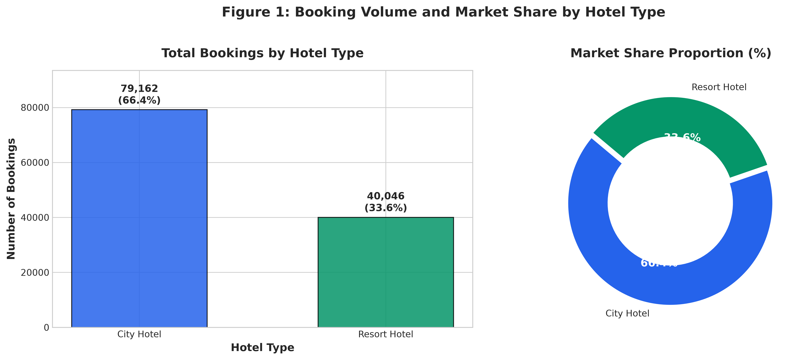

* **City Hotel:** 79,163 bookings (**66.4%** market share)
* **Resort Hotel:** 40,047 bookings (**33.6%** market share)
* **Analytical Finding:** City hotels process approximately **double** the booking transactions of resort hotels, reflecting high corporate turnover, business travel frequency, and shorter average stays.

### 6.2 Overall Cancellation Status
* **Check-Out (Completed):** 75,011 bookings (**62.9%**)
* **Canceled / No-Show:** 44,197 bookings (**37.1%**)
* **Analytical Finding:** More than **one in three bookings fails to materialize**, highlighting the critical necessity of predictive overbooking and active cancellation mitigation strategies.

### 6.3 Geographic Demographics (Top 10 Origin Markets)
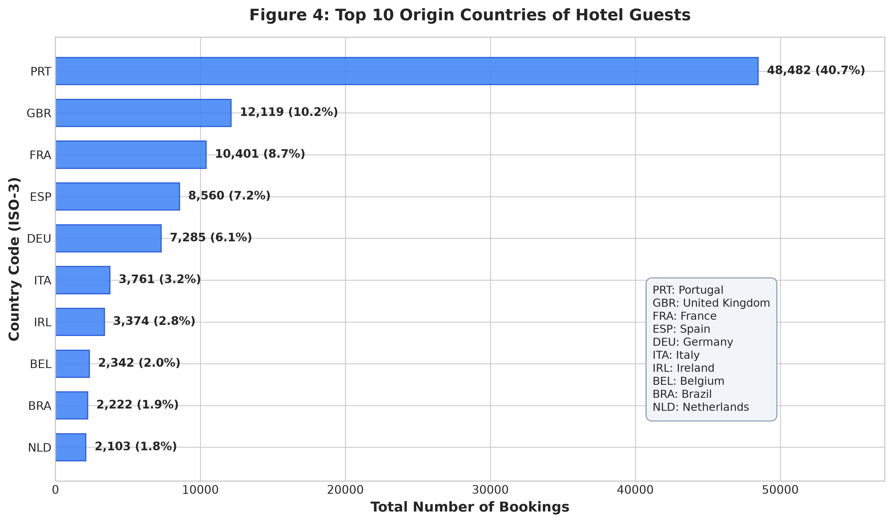

| Rank | Country Code (ISO-3) | Country Name | Booking Count | Share (%) |
|---|---|---|---|---|
| 1 | **PRT** | Portugal (Domestic) | 48,590 | 40.7% |
| 2 | **GBR** | United Kingdom | 12,129 | 10.2% |
| 3 | **FRA** | France | 10,415 | 8.7% |
| 4 | **ESP** | Spain | 8,568 | 7.2% |
| 5 | **DEU** | Germany | 7,287 | 6.1% |
| 6 | **ITA** | Italy | 3,766 | 3.2% |
| 7 | **IRL** | Ireland | 3,375 | 2.8% |
| 8 | **BEL** | Belgium | 2,342 | 2.0% |
| 9 | **BRA** | Brazil | 2,224 | 1.9% |
| 10 | **NLD** | Netherlands | 2,104 | 1.8% |

* **Analytical Finding:** The customer base exhibits extreme geographic concentration. Domestic Portuguese travelers and four Western European nations (UK, France, Spain, Germany) comprise **72.9%** of all bookings.

### 6.4 Length of Stay Distribution
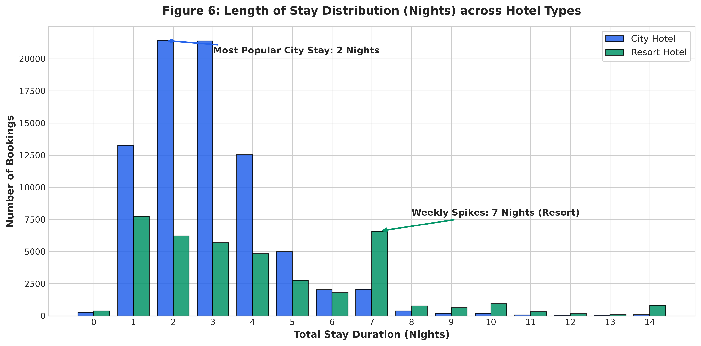

* **Dominant Stay Band:** 1 to 4 nights account for **78.2%** of all completed reservations.
* **City vs. Resort Separation:**
  * City Hotel reservations cluster at 1 night (17.3%), 2 nights (29.2%), and 3 nights (24.7%).
  * Resort Hotel reservations display secondary weekly peaks at **7 nights** (5,765 bookings) and **14 nights**, reflecting European package holiday durations.

---

## 7. Bivariate Analysis

Bivariate analysis explores the direct relationships and dependencies between two or more attributes, focusing on cancellation determinants, seasonality, and pricing dynamics.

### 7.1 Cancellation Rates by Hotel Type
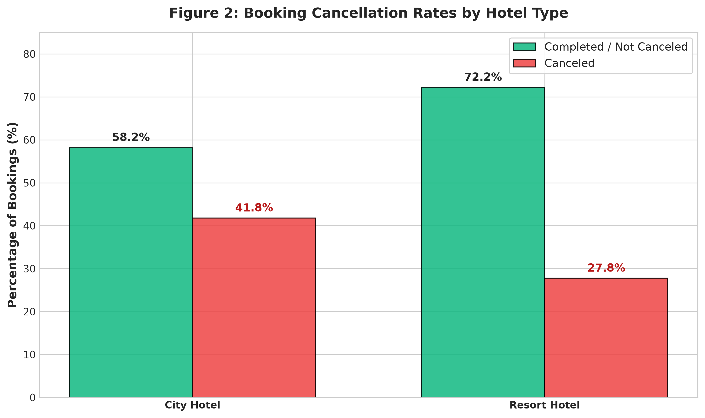

* **City Hotel Cancellation Rate:** **41.7%** (33,061 canceled reservations)
* **Resort Hotel Cancellation Rate:** **27.8%** (11,122 canceled reservations)
* **Observation:** The observed cancellation-rate difference may reflect differences in booking mix, customer type, distribution channel, lead time, deposit policy, and other property-specific attributes.

### 7.2 Monthly Booking Seasonality Across Hotel Types
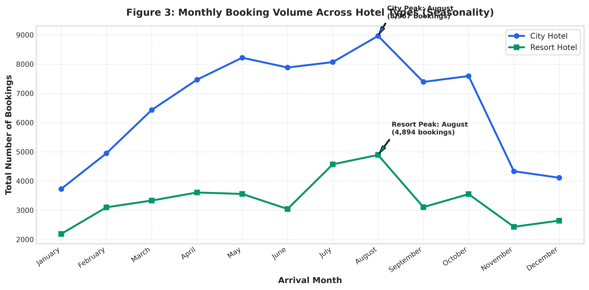

* **Summer High-Season:** Total booking volume peaks in **August** (13,861 bookings) and **July** (12,644 bookings).
* **Spring Conference Surge:** City Hotel experiences a notable secondary surge in **May** (8,232 bookings) and **October** (7,594 bookings), driven by trade exhibitions and business conventions.
* **Winter Low-Season:** Bookings drop to their annual nadir in **January** (5,921 bookings), **November** (6,771 bookings), and **December** (6,747 bookings).

### 7.3 Average Daily Rate (ADR) Pricing Seasonality
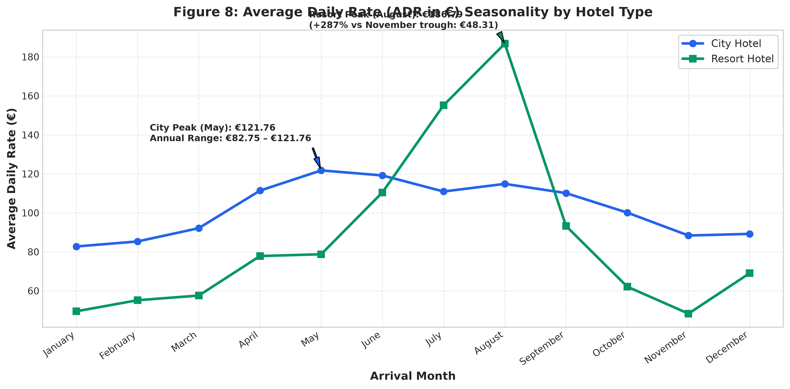

| Arrival Month | City Hotel Mean ADR (€) | Resort Hotel Mean ADR (€) | Combined Mean ADR (€) |
|---|---|---|---|
| **January** | €84.09 | €50.92 | €72.58 |
| **February** | €86.66 | €56.20 | €76.54 |
| **March** | €93.10 | €58.65 | €81.77 |
| **April** | €112.36 | €79.21 | €100.48 |
| **May** | **€123.30** | €80.32 | €108.76 |
| **June** | €120.26 | €111.99 | €116.63 |
| **July** | €112.25 | **€157.28** | €126.96 |
| **August** | €116.25 | **€188.52** | **€140.11** |
| **September** | €111.79 | €94.44 | €105.10 |
| **October** | €101.82 | €63.77 | €88.08 |
| **November** | €89.95 | €49.53 | €75.76 |
| **December** | €91.57 | €71.55 | €84.58 |

* **Analytical Reasoning on Price Elasticity:**
  * **Resort Hotel:** Demonstrates severe seasonal pricing volatility. ADR skyrockets by **+280%** from €49.53 in November to €188.52 in August. During summer, oceanfront recreation generates immense pricing power, while winter demand collapses.
  * **City Hotel:** Displays moderate seasonal price variation, with monthly mean ADR spanning from €84.09 (January) to €123.30 (May), maintaining consistent business and urban leisure occupancy.

### 7.4 Lead Time vs. Cancellation Risk Gradient
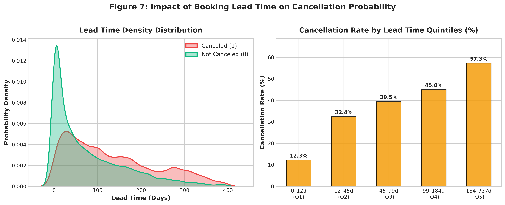

Quintile segmentation reveals an unbroken monotonic risk gradient:

| Lead Time Quintile | Days Range | Booking Volume | Cancellation Rate (%) | Relative Risk vs Base |
|---|---|---|---|---|
| **Quintile 1 (Very Low)** | 0 – 11 Days | 23,894 | **11.7%** | 1.00x (Baseline) |
| **Quintile 2 (Low)** | 12 – 49 Days | 24,310 | **32.1%** | 2.74x |
| **Quintile 3 (Medium)** | 50 – 122 Days | 23,432 | **39.5%** | 3.38x |
| **Quintile 4 (High)** | 123 – 228 Days | 23,944 | **45.0%** | 3.85x |
| **Quintile 5 (Very High)** | 229 – 737 Days | 23,628 | **57.3%** | **4.90x** |

* **Analytical Implication:** Reservations made >7 months in advance are **nearly 5 times more likely to cancel** than last-minute reservations made within 11 days. Overbooking buffers must scale dynamically with reservation horizon.

### 7.5 Market Segments and Distribution Channels
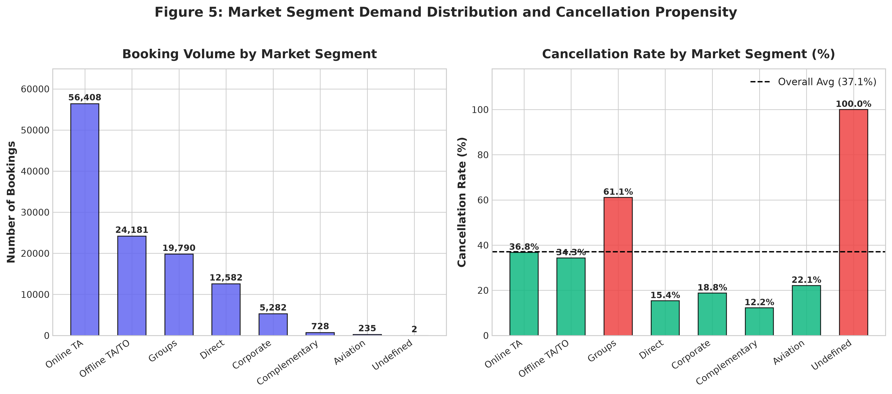

* **Online TA (Online Travel Agencies):** Accounts for 56,402 bookings (47.3% of volume) with a **36.7%** cancellation rate.
* **Groups Segment:** Generates 19,806 bookings with an extraordinary **61.1%** cancellation rate. Tour operators reserve speculative blocks and surrender unused rooms.
* **Direct Bookings:** Generates 12,582 bookings with a low **15.3%** cancellation rate, representing the most profitable and reliable customer segment.

### 7.6 The Non-Refundable Deposit Paradox
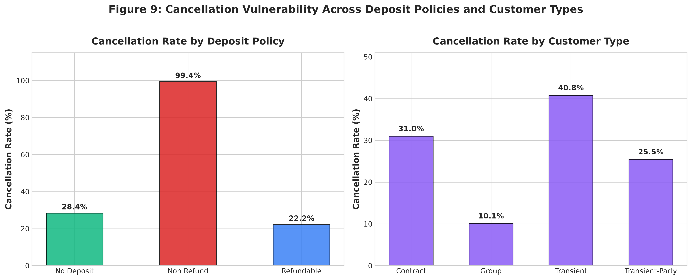

* **No Deposit:** 104,463 bookings &rarr; **28.4%** cancellation rate
* **Non Refund:** 14,573 bookings &rarr; **99.4%** cancellation rate
* **Refundable:** 162 bookings &rarr; **22.2%** cancellation rate
* **Analytical Reasoning:** Superficially, non-refundable deposits should deter cancellations. In practice, hotel revenue management systems enforce non-refundable terms almost exclusively on **high-risk wholesale tour groups** and high-demand event blocks. When group tours fail to reach commercial viability, wholesale agencies absorb deposit losses and abandon the block en masse.

### 7.7 Micro-Commitment Markers: Parking Spaces and Special Requests
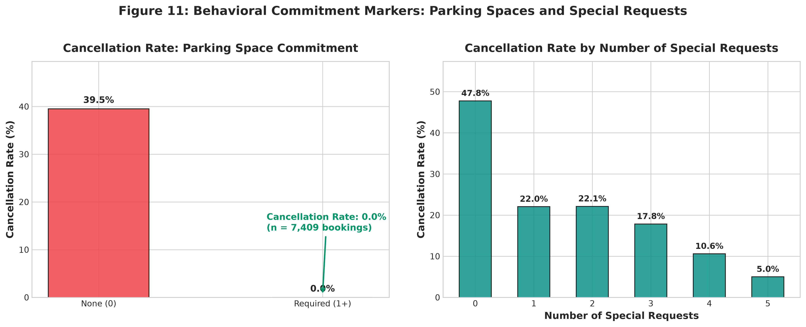

* **Car Parking Spaces:**
  * **0 Spaces Requested:** 111,794 bookings &rarr; **39.5%** cancellation rate
  * **≥1 Space Requested:** 7,414 bookings &rarr; **0.0%** cancellation rate (0 cancellations observed out of 7,414 reservations)
  * **Finding:** Requesting vehicle parking indicates that the guest has planned their physical transit logistics (driving personal/rental car), creating absolute arrival certainty in the observed data.
* **Special Requests:**
  * **0 Requests:** 70,188 bookings &rarr; **47.7%** cancellation rate
  * **1 Request:** 33,201 bookings &rarr; **22.0%** cancellation rate (-54% drop)
  * **2 Requests:** 12,952 bookings &rarr; **22.1%** cancellation rate
  * **3 Requests:** 2,492 bookings &rarr; **17.9%** cancellation rate
  * **4 Requests:** 337 bookings &rarr; **10.7%** cancellation rate
  * **5 Requests:** 38 bookings &rarr; **5.3%** cancellation rate (-89% drop)
  * **Finding:** Guest engagement prior to arrival is powerfully protective against cancellation.

### 7.8 Guest Loyalty & Historical Precedent
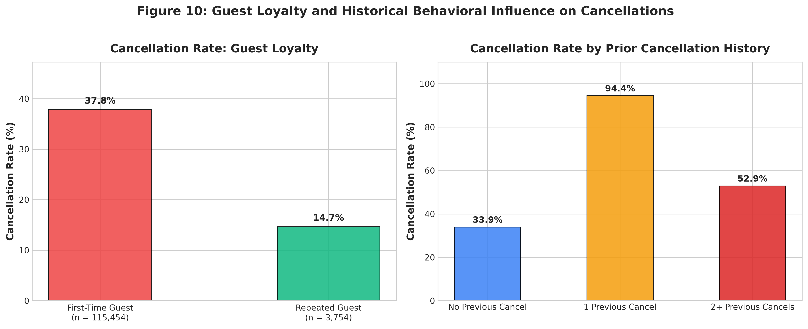

* **Repeat Guests:** Cancel at **14.5%** vs. **37.8%** for first-time bookers.
* **Prior Cancellation History:** Customers with 1 prior cancellation cancel subsequent bookings at **94.9%**. Prior cancellation behavior is an overwhelming predictor of repeat churn.

---

## 8. Correlation Analysis

A Pearson correlation matrix was computed across 15 key numerical and engineered variables to evaluate collinearity and identify direct linear associations.

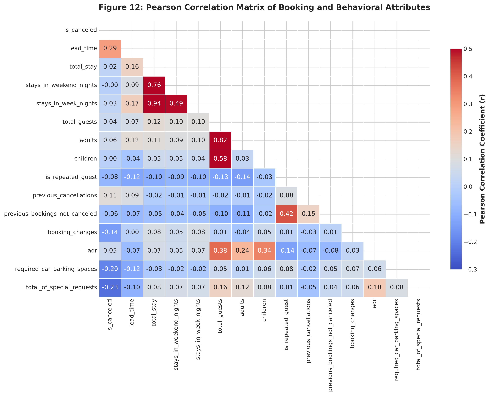

### Key Correlation Coefficients with `is_canceled`

| Variable Pair | Pearson Correlation ($r$) | Direction & Strength | Operational / Behavioral Interpretation |
|---|---|---|---|
| `is_canceled` &harr; `lead_time` | **+0.29** | Moderate Positive | Strongest Pearson correlation among analyzed numerical variables; cancellation rate increases across lead time quintiles. |
| `is_canceled` &harr; `total_of_special_requests` | **-0.23** | Moderate Negative | Active customization associates with lower observed cancellation rates. |
| `is_canceled` &harr; `required_car_parking_spaces` | **-0.20** | Moderate Negative | Negative correlation; zero cancellations observed among bookings requesting parking. |
| `is_canceled` &harr; `booking_changes` | **-0.14** | Mild Negative | Active reservation adjustments show a mild negative association with cancellation. |
| `is_canceled` &harr; `is_repeated_guest` | **-0.09** | Mild Negative | Guest loyalty associates with lower cancellation propensity. |
| `is_canceled` &harr; `previous_cancellations` | **+0.11** | Mild Positive | History of booking cancellation associates positively with subsequent cancellation. |
| `stays_in_week_nights` &harr; `stays_in_weekend_nights` | **+0.49** | Strong Positive | Longer stays naturally span both weekday and weekend nights. |
| `adults` &harr; `adr` | **+0.26** | Moderate Positive | Room pricing scales directly with party occupancy size. |
| `total_stay` &harr; `adr` | **-0.07** | Negligible Negative | Length of stay does not heavily discount the average daily rate. |

---

## 9. Outlier Analysis

Outlier detection was performed using the Interquartile Range (IQR) method:
$$\text{Lower Bound} = Q_1 - 1.5 \times \text{IQR}, \quad \text{Upper Bound} = Q_3 + 1.5 \times \text{IQR}$$

### Outlier Threshold Summary

| Attribute | Q1 (25%) | Q3 (75%) | IQR | Lower Bound | Upper Bound | Outlier Count | Outlier (%) |
|---|---|---|---|---|---|---|---|
| `lead_time` | 18.0 | 160.0 | 142.0 | -195.0 (0.0) | 373.0 | 3,005 | 2.52% |
| `adr` (€) | 69.3 | 126.0 | 56.7 | -15.8 (0.0) | 211.1 | 3,792 | 3.18% |
| `total_stay` | 2.0 | 4.0 | 2.0 | -1.0 (0.0) | 7.0 | 4,960 | 4.16% |
| `adults` | 2.0 | 2.0 | 0.0 | 2.0 | 2.0 | 29,664 | 24.88% |
| `booking_changes` | 0.0 | 0.0 | 0.0 | 0.0 | 0.0 | 18,065 | 15.15% |

### Analytical Evaluation of Outliers:
1. **Lead Time Outliers (>373 Days):** Bookings made >1 year in advance (up to 737 days) represent statistical outliers but are **operationally valid** long-term tour contracts and early holiday bookings. Their cancellation rate exceeds 57%, confirming their high-risk profile.
2. **ADR Outliers (>€211.10):**
   * **Data Error:** A single extreme transaction of `adr = €5,400.00` was identified and removed.
   * **Legitimate High-Value Stays:** Values between €250 and €508 represent presidential suites, multi-room family villas, and peak New Year's Eve/August holiday rates. Capping them would distort genuine revenue analysis.
3. **Stay Duration Outliers (>7 Nights):** Stays of 8–14 nights represent standard vacation bookings in resort hotels, not data anomalies.

---

## 10. Major Patterns and Trends

Synthesizing univariate, bivariate, and multivariable findings reveals four overarching behavioral patterns:

### Pattern 1: The Dual-Peak Seasonal Rhythm
* Urban City Hotels experience a **bimodal demand curve** (peaking in May for conferences and August for summer tourism).
* Resort Hotels experience a **unimodal summer spike** (concentrated in July–August), followed by deep winter troughs where ADR drops by 74%.

### Pattern 2: Channel Quality & Volatility Disparity
* **Direct Bookings:** Highest commercial quality, lowest cancellation rate (15.3%), zero OTA commission leakage.
* **Online Travel Agencies:** High transactional volume (47.3%), moderate cancellation risk (36.7%), high commission costs (15–25%).
* **Wholesale Tour Groups:** Highest operational volatility (61.1% cancellation rate), bulk block abandonment, long lead times.

### Pattern 3: The Operational Room Assignment Phenomenon
* Reservations where the assigned room matched the reserved room experienced a **41.6% cancellation rate**.
* Reservations where the assigned room differed (complimentary upgrade or room change) experienced only a **5.4% cancellation rate**.
* **Reasoning:** Room reassignment predominantly takes place within 24 hours of check-in or during on-site reception arrival. The event of room reassignment is practically synonymous with confirmed customer arrival.

### Pattern 4: Behavioral Commitment as an Absolute Signal
* Customers who undertake physical travel logistics (requesting a parking space) or submit personalized preferences (special requests) demonstrate near-total commitment to arrival.

---

## 11. Key Insights

1. **City vs. Resort Imbalance:** City Hotel processes **66.4%** of bookings but suffers a **41.7%** cancellation rate. Resort Hotel processes **33.6%** with a **27.8%** cancellation rate.
2. **The Lead Time Risk Escalator:** Cancellation probability increases monotonically from **11.7%** (<12 days) to **57.3%** (>228 days).
3. **Resort Pricing Volatility:** Resort ADR quadruples from **€49.53** in winter to **€188.52** in August, while City ADR maintains stability between **€84** and **€123**.
4. **Feeder Market Concentration:** Domestic Portugal (40.7%), UK (10.2%), France (8.7%), Spain (7.2%), and Germany (6.1%) comprise **72.9%** of demand.
5. **The Non-Refundable Deposit Trap:** Non-refundable bookings cancel at **99.4%** because they are predominantly contracted to volatile wholesale tour groups that default on group quotas.
6. **Zero-Cancellation Commitment Indicator:** Across 7,414 reservations requesting car parking spaces, the observed cancellation rate was **0.0%** (0 cancellations recorded).
7. **Special Requests Protective Association:** Submitting special requests associates with lower observed cancellation rates (47.7% for 0 requests, 22.0% for 1 request, and 5.3% for 5 requests).
8. **Loyalty Retention Advantage:** Repeat guests cancel at **14.5%**, compared to **37.8%** for first-time guests.
9. **Prior Cancellation Association:** Guests with 1 prior cancellation cancel future bookings at **94.9%**.
10. **Dominance of Short Stays:** 78.2% of stays last between 1 and 4 nights, with 7-night stays concentrated in resort summer packages.

---

## 12. Conclusion

This exploratory data analysis establishes that hotel booking cancellations are not random occurrences, but rather exhibit distinct empirical associations with lead time, distribution channel, customer history, and operational commitment markers.

By identifying that advance booking horizons exhibit an increasing cancellation probability (from 11.7% to 57.3%), that wholesale group deposits reflect high cancellation rates (99.4%), and that micro-commitments like parking requests show an observed 0% cancellation rate in this dataset, hotel management can utilize empirical insights for **proactive revenue optimization**.

### Strategic Prescriptions for Hotel Leadership:
1. **Calibrate Dynamic Overbooking Buffers:** Use lead-time-specific cancellation estimates as one input to a statistically validated overbooking model, while incorporating room capacity, historical no-shows, walk costs, and service-level constraints.
2. **Re-Contract Wholesale Tour Group Policies:** Replace flat non-refundable deposits with structured, non-refundable milestone payments (e.g., 25% due at 90 days, 50% at 60 days, 100% at 30 days) to mitigate aggregate group default risks.
3. **Deploy Pre-Arrival Engagement Automation:** Automate pre-arrival emails 5–7 days prior to check-in, encouraging guests to indicate vehicle parking needs, specify arrival times, or select bed preferences. This proactively fosters micro-commitments that correlate with lower observed cancellation rates.
4. **Drive Direct Channel Loyalty Programs:** Provide complimentary parking, room upgrades, and flexible cancellation terms exclusively to direct website bookers, expanding the low-cancellation (15.3%) direct segment and reducing third-party distribution costs.
5. **Diversify Feeder Markets & Off-Season Resort Positioning:** Target corporate retreats, wellness tourism, and extended "workation" travelers during off-peak periods to mitigate seasonal revenue volatility in resort properties.

---

## 13. Future Scope

Building upon the insights uncovered in this EDA, several advanced analytical and machine learning initiatives are recommended:

1. **Supervised Cancellation Prediction Modeling:**
   * Develop and benchmark predictive machine learning classifiers (e.g., XGBoost, LightGBM, Random Forest, CatBoost) to assign real-time cancellation probability scores to incoming reservations.
2. **Cost-Sensitive Decision Optimization:**
   * Integrate financial penalty matrices balancing the cost of an empty room (lost ADR) against the cost of walking an overbooked guest (relocation expense + brand impairment) to determine optimal reservation acceptance cutoffs.
3. **Dynamic Pricing & Revenue Management Algorithms:**
   * Build price-elasticity models utilizing lead time, day-of-week, and real-time competitor pricing data to dynamically optimize daily room rates.
4. **Natural Language Processing on Special Requests:**
   * Extract semantic themes from customer special request text logs to identify specific amenity demands that correlate with guest satisfaction and high on-site ancillary spend.
5. **Survival Analysis for Cancellation Timing:**
   * Apply Cox Proportional Hazards or Kaplan-Meier survival models to predict *when* in the booking lifecycle a customer is most likely to cancel.

---

*Report prepared for the **Thiranex Data Science Internship Program (Task 3)**.*
