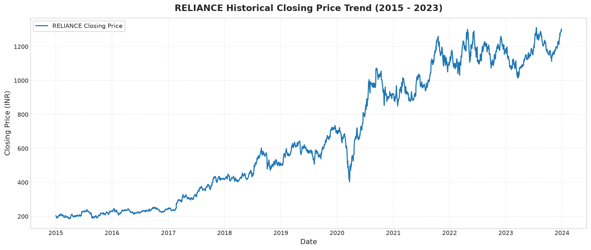
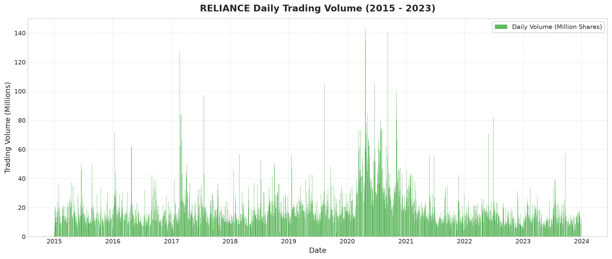
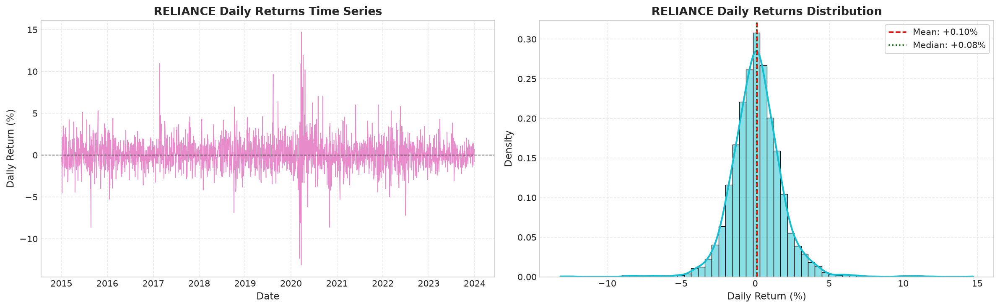
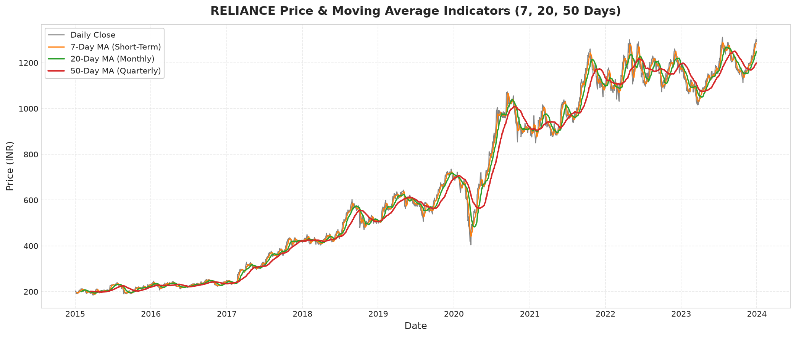
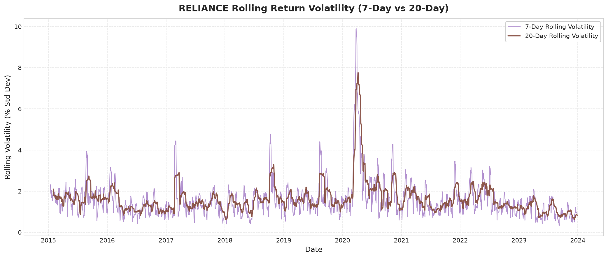
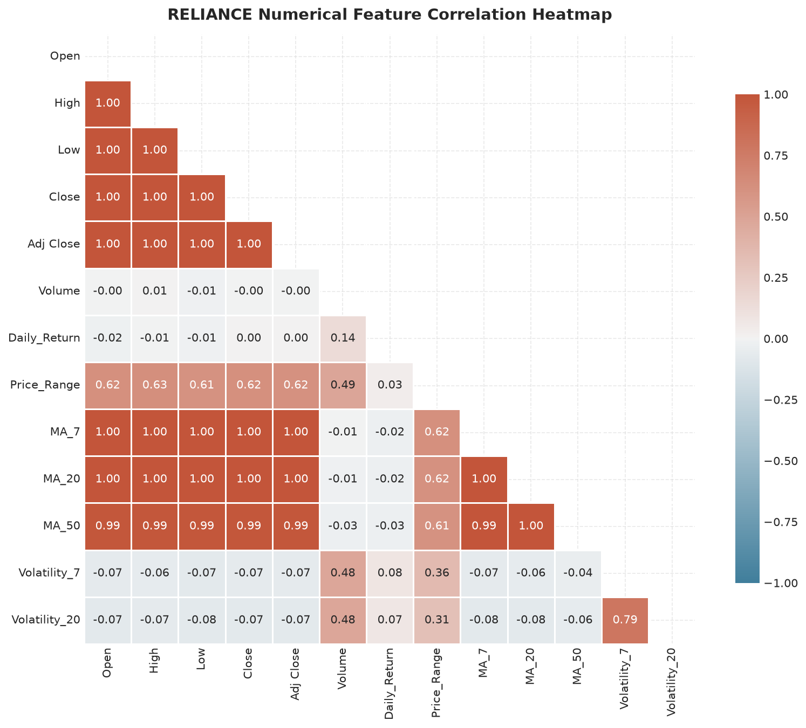
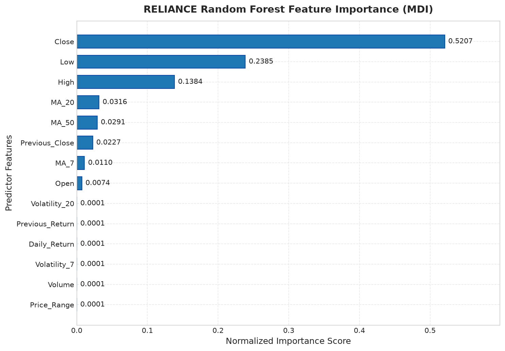
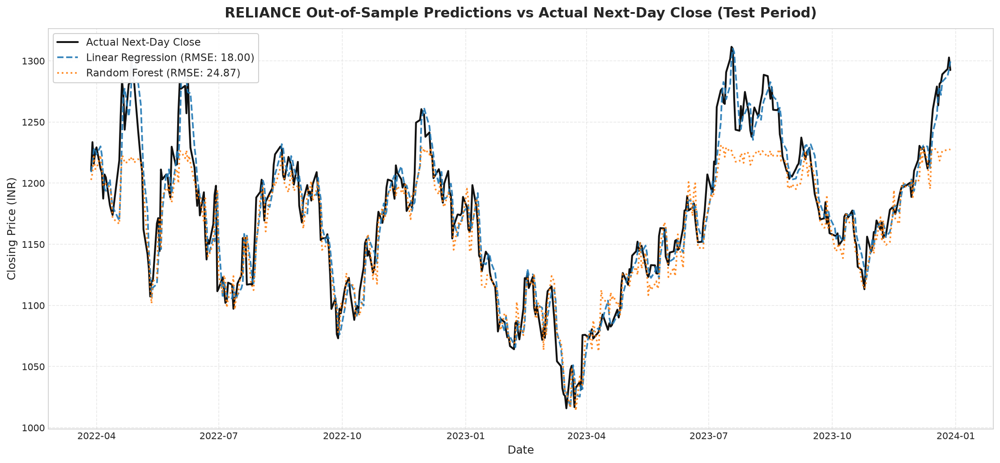

# Task 4: Indian Stock Market Analysis and Next-Day Price Prediction

**Thiranex Internship — Task 4: Real-World Data Project (Finance Domain)**  
**Author:** Sanjai B  
**Due Date:** 02 October 2026  
**Status:** Completed & Empirically Validated  

---

## 1. Project Overview

Financial price forecasting is a classic challenge in quantitative finance and predictive analytics. Financial asset prices reflect a complex mixture of macroeconomic trends, corporate performance, liquidity conditions, and market sentiment. 

This project delivers an end-to-end data science and machine learning solution using historical daily equity trading records from the **National Stock Exchange of India (NSE)** covering a 9-year span from **2015 through 2023**. Focusing on India's premier corporate equity, **Reliance Industries Limited (`RELIANCE`)**, the project encompasses data ingestion, rigorous quality audits, exploratory data analysis, leak-free feature engineering, and chronological machine learning regression benchmarking.

---

## 2. Objective

The primary objectives of this project are:
1. **Acquire & Audit Real-World Data:** Ingest and evaluate authentic NSE equity data, testing for completeness, logical price consistency, and potential duplicate records.
2. **Exploratory Data Analysis (EDA):** Identify multi-year bull/bear cycles, trading volume spikes, daily return distributions, moving averages, and rolling volatility regimes.
3. **Econometric Feature Engineering:** Construct technical indicators (moving averages, price spreads, return volatility, autoregressive lags) while strictly eliminating lookahead bias.
4. **Machine Learning Forecasting:** Train and benchmark parametric (**Linear Regression**) and non-parametric ensemble (**Random Forest Regressor**) architectures to predict the **Next-Day Closing Price** ($P_{t+1}$).
5. **Model Interpretability & Empirical Evaluation:** Assess predictive accuracy using Mean Absolute Error (MAE), Root Mean Squared Error (RMSE), and the Coefficient of Determination ($R^2$), and interpret feature importances.

---

## 3. Dataset

The analysis is conducted on the multi-stock daily equity dataset:
* **Filename:** `data/nifty500_stocks.csv`
* **Total Observations:** 219,800 rows
* **Total Columns:** 8 variables
* **Cross-Sectional Coverage:** 106 unique NSE stock symbols
* **Temporal Horizon:** 01 January 2015 to 29 December 2023 (9 full calendar years)
* **Standard Historical Sessions per Stock:** 2,221 trading days

### Schema Description:
| Column | Type | Description |
| :--- | :--- | :--- |
| `Date` | datetime64 | Trading calendar date (YYYY-MM-DD) |
| `Symbol` | string | NSE equity ticker symbol (e.g., `RELIANCE`, `TCS`, `INFY`) |
| `Open` | float64 | Opening auction clearing price (INR) |
| `High` | float64 | Intraday maximum transacted price (INR) |
| `Low` | float64 | Intraday minimum transacted price (INR) |
| `Close` | float64 | Official session closing price (INR) |
| `Adj Close` | float64 | Corporate action adjusted closing price (dividends & splits) |
| `Volume` | int64 | Total shares transacted during the session |

---

## 4. Dataset Source

* **Kaggle Dataset:** `manavanghan/nse-india-stock-market-data-2015-2024`
* **Dataset URL:** [https://www.kaggle.com/datasets/manavanghan/nse-india-stock-market-data-2015-2024](https://www.kaggle.com/datasets/manavanghan/nse-india-stock-market-data-2015-2024)
* **Underlying Exchange:** National Stock Exchange of India (NSE)

---

## 5. Technologies Used

* **Language:** Python 3.12.0
* **Data Manipulation & Analysis:** `pandas` (v3.0.5), `numpy` (v2.5.2), `scipy` (v1.18.1)
* **Data Visualization:** `matplotlib` (v3.11.1), `seaborn` (v0.13.2)
* **Machine Learning & Metrics:** `scikit-learn` (v1.9.1)
* **Interactive Notebook:** `jupyter`, `nbformat` (v5.11.1), `nbclient` (v0.11.0)
* **Report Generation:** `reportlab` (v5.0.1), `pypdf` (v6.18.1)

---

## 6. Project Workflow

The project follows a modular, reproducible workflow:
```text
Raw NSE Data Ingestion (data/nifty500_stocks.csv)
       │
       ▼
Data Quality & Integrity Audit (Nulls, Duplicates, Logical Price Bounds)
       │
       ▼
Stock Selection & Profiling (Reliance Industries - RELIANCE)
       │
       ▼
Exploratory Data Analysis (EDA) ──► 6 Diagnostic Plots Saved to images/
       │
       ▼
Lookahead-Free Feature Engineering (Lags, Spreads, Moving Averages, Volatility)
       │
       ▼
Strict Chronological Train/Test Partitioning (80% Train / 20% Test)
       │
       ▼
Model Training: Linear Regression vs. Random Forest Regressor (200 Trees)
       │
       ▼
Model Evaluation & Benchmarking (MAE, RMSE, R²)
       │
       ▼
Diagnostic Visualizations (images/07_feature_importance.png, images/08_actual_vs_predicted.png)
       │
       ▼
Deliverables Compilation: Notebook Execution, README.md, Project_Report.pdf (15 pages)
```

---

## 7. Data Cleaning

A comprehensive multi-point integrity audit was performed across all 219,800 dataset records:

1. **Missing Value Audit:** Zero missing values across all columns (`0.00%` null rate).
2. **Duplicate Analysis:** Verified across all tickers. Exact duplicates occurred only within `INFY` due to a double-appended series in the raw source; `RELIANCE` contains exactly 2,221 continuous records with 0 duplicate rows.
3. **Price Bounds Validity:** Tested `Open <= 0`, `High <= 0`, `Low <= 0`, `Close <= 0`, `Volume < 0`. Found **0 violations** (100% strictly positive prices and non-negative volume).
4. **Logical Consistency:** Tested `High >= Low`, `High >= Open`, `High >= Close`, `Low <= Open`, and `Low <= Close`. Found **0 violations** across the entire dataset.

### Stock Selection Rationale:
**Reliance Industries Limited (`RELIANCE`)** was chosen dynamically:
* Fully continuous historical record of 2,221 trading days (2015 to 2023).
* Largest company in India by market capitalization (>INR 19 Lakh Crore / ~$230 Billion).
* Heavyweight constituent of both NIFTY 50 and SENSEX indices.
* Broad conglomerate exposure encompassing Oil-to-Chemicals (O2C), Telecom (Jio Platforms), Retail (Reliance Retail), and Renewable Energy.

---

## 8. Feature Engineering

To predict the **Next-Day Closing Price** ($P_{t+1}$), technical predictors were constructed strictly from market observables available on or before session $t$:

* **Target Variable:** `Next_Day_Close` = $\text{Close}_{t+1}$ (1-day lead shift)
* **Predictor Features (14 variables):**
  * `Open`, `High`, `Low`, `Close`: Core session price benchmarks
  * `Volume`: Intraday liquidity volume
  * `Daily_Return`: Percentage price change $\frac{\text{Close}_t - \text{Close}_{t-1}}{\text{Close}_{t-1}}$
  * `Price_Range`: Intraday price dispersion $\text{High}_t - \text{Low}_t$
  * `Previous_Close`: Autoregressive lagged price $\text{Close}_{t-1}$
  * `Previous_Return`: Autoregressive lagged return $\text{Daily\_Return}_{t-1}$
  * `MA_7`: 7-day rolling moving average (weekly momentum)
  * `MA_20`: 20-day rolling moving average (monthly trend)
  * `MA_50`: 50-day rolling moving average (quarterly trend)
  * `Volatility_7`: 7-day rolling standard deviation of daily returns
  * `Volatility_20`: 20-day rolling standard deviation of daily returns

Pruning rows with undefined rolling windows leaves **2,171 valid, continuous observations** for modeling (16 March 2015 to 28 December 2023).

---

## 9. Exploratory Data Analysis

### Key Statistical Milestones (Reliance Industries):
* **Mean Closing Price:** INR 668.40
* **Median Closing Price:** INR 584.53
* **All-Time Low Price:** INR 185.32 (30 March 2015)
* **All-Time High Price:** INR 1,311.51 (19 July 2023)
* **Mean Daily Return:** +0.0992% per trading day
* **Daily Return Volatility (Std Dev):** 1.7805%
* **Average Daily Trading Volume:** 19,003,011 shares
* **Peak Trading Volume Date:** 22 April 2020 (142,683,366 shares, following Meta's $5.7B investment in Jio)
* **Largest Single-Day Gain:** +14.72% (25 March 2020)
* **Largest Single-Day Loss:** -13.15% (23 March 2020, COVID-19 nationwide lockdown initiation)

---

## 10. Machine Learning

Two distinct regression paradigms were evaluated under a strict chronological partition:

1. **Linear Regression (Ordinary Least Squares):**
   * Computes an analytical closed-form hyperplane: $\hat{y}_{t+1} = \beta_0 + \sum_{j=1}^d \beta_j X_{t, j}$
   * Acts as a continuous smoothing operator with near-martingale autoregressive properties.
2. **Random Forest Regressor:**
   * Ensemble of $B = 200$ de-correlated decision trees trained with bootstrap aggregating (`random_state=42`, `n_jobs=-1`).
   * Captures non-linear feature interactions and threshold volatility regimes.

### Chronological Train-Test Split (No Shuffling):
* **Training Period:** 16 March 2015 to 25 March 2022 (1,736 observations, 80.0%)
* **Testing Period:** 28 March 2022 to 28 December 2023 (435 observations, 20.0%)

---

## 11. Model Evaluation

Both models were evaluated on the 435 out-of-sample test trading sessions:

$$\text{MAE} = \frac{1}{n}\sum_{i=1}^n |y_i - \hat{y}_i|, \quad \text{RMSE} = \sqrt{\frac{1}{n}\sum_{i=1}^n (y_i - \hat{y}_i)^2}, \quad R^2 = 1 - \frac{\sum (y_i - \hat{y}_i)^2}{\sum (y_i - \bar{y})^2}$$

---

## 12. Results

### Out-of-Sample Performance Comparison:
| Model Architecture | Test MAE (INR) | Test RMSE (INR) | Test $R^2$ Score | Performance Rank |
| :--- | :---: | :---: | :---: | :---: |
| **Linear Regression** | **13.7910** | **18.0000** | **0.9146** | **Rank 1 (Best)** |
| **Random Forest Regressor** | 18.2264 | 24.8724 | 0.8369 | Rank 2 |

### Key Observations:
* **Linear Regression** achieved the lowest test RMSE (18.0000) and lowest MAE (INR 13.7910), outperforming Random Forest by **27.6%** in RMSE.
* Linear Regression explained **91.46%** of out-of-sample price variance ($R^2 = 0.9146$).
* Random Forest achieved an $R^2$ of 0.8369. Decision tree splits are bounded by training sample extrema, leading to plateaued predictions during new all-time highs in the 2022–2023 testing period.

### Ranked Feature Importance (Random Forest MDI):
| Rank | Feature | Importance Score | Relative Share |
| :---: | :--- | :---: | :---: |
| 1 | `Close` | 0.520694 | 52.07% |
| 2 | `Low` | 0.238507 | 23.85% |
| 3 | `High` | 0.138353 | 13.84% |
| 4 | `MA_20` | 0.031638 | 3.16% |
| 5 | `MA_50` | 0.029090 | 2.91% |
| 6 | `Previous_Close` | 0.022701 | 2.27% |
| 7 | `MA_7` | 0.011045 | 1.10% |
| 8 | `Open` | 0.007396 | 0.74% |
| 9–14 | `Volatility_20`, `Previous_Return`, `Daily_Return`, `Volatility_7`, `Volume`, `Price_Range` | < 0.0002 each | < 0.1% |

Current-session price levels (`Close`, `Low`, `High`) account for **89.76%** of total impurity reduction.

---

## 13. Visualizations

All generated visualizations are saved in `images/`:

| File | Description | Visual Preview |
| :--- | :--- | :---: |
| `01_stock_price_trend.png` | Historical closing price trend (2015–2023) |  |
| `02_trading_volume.png` | Daily trading volume and institutional liquidity spikes |  |
| `03_daily_returns.png` | Daily return time series & density distribution |  |
| `04_moving_averages.png` | Technical moving averages (7, 20, 50 days) against price |  |
| `05_volatility.png` | 7-day and 20-day rolling return volatility over time |  |
| `06_correlation_heatmap.png` | Pearson correlation matrix across numerical variables |  |
| `07_feature_importance.png` | Ranked MDI feature importance from Random Forest |  |
| `08_actual_vs_predicted.png` | Actual vs. predicted closing prices on the test period |  |

---

## 14. Key Findings

1. **Multi-Year Capital Growth:** RELIANCE experienced a structural bull run from 2015 to 2023, expanding from an all-time low of INR 185.32 to an all-time high of INR 1,311.51 (+607% capital growth).
2. **Fat-Tailed Return Distribution:** Daily returns averaged +0.0992% per day with a daily standard deviation of 1.7805%. Excess kurtosis (8.47) confirms that equity markets experience heavy-tailed shocks.
3. **Liquidity Catalysts:** Trading volume averaged 19.00 million shares daily, reaching a historic peak of 142.68 million shares on 22 April 2020 following the Meta-Jio partnership announcement.
4. **Predictive Performance:** Linear Regression demonstrated superior out-of-sample accuracy (RMSE: INR 18.0000, MAE: INR 13.7910, $R^2$: 0.9146) compared to Random Forest (RMSE: INR 24.8724, MAE: INR 18.2264, $R^2$: 0.8369).
5. **Autoregressive Anchoring:** Current session price metrics account for ~90% of model importance, confirming strong near-martingale properties in next-day equity pricing.

---

## 15. Limitations

1. **Historical Performance Non-Guarantee:** Past patterns do not guarantee future profitability as market dynamics and participant behaviors change.
2. **Exclusion of External Macro Catalysts:** The model relies solely on historical price and volume data. It omits real-time economic indicators (RBI interest rates, inflation, crude oil prices, geopolitical shocks) and corporate news disclosures.
3. **Execution Frictions & Slippage:** Theoretical test accuracy ($R^2 = 0.9146$) does not translate directly into trading profits. Live trading incurs exchange turnover fees, STT, brokerage commissions, and bid-ask spread slippage.
4. **Tree Extrapolation Constraints:** Random Forest regression models cannot extrapolate beyond the price bounds observed during training.
5. **Educational Disclaimer:** This project is strictly academic and educational. It does not constitute financial advice or investment recommendations.

---

## 16. Project Structure

```text
Task-4/
│
├── data/
│   └── nifty500_stocks.csv          # Raw Kaggle NSE dataset (219,800 rows, 106 stocks)
│
├── images/
│   ├── 01_stock_price_trend.png     # Price trajectory over time
│   ├── 02_trading_volume.png        # Historical trading volume dynamics
│   ├── 03_daily_returns.png         # Daily return time-series and distribution
│   ├── 04_moving_averages.png       # 7-day, 20-day, 50-day moving averages
│   ├── 05_volatility.png            # 7-day and 20-day rolling return volatility
│   ├── 06_correlation_heatmap.png   # Pearson correlation heatmap
│   ├── 07_feature_importance.png    # Random Forest feature importance ranking
│   └── 08_actual_vs_predicted.png   # Out-of-sample actual vs predicted prices
│
├── stock_price_prediction.ipynb     # Fully executed Jupyter Notebook (41 cells, 0 errors)
├── README.md                        # Professional project documentation
└── Project_Report.pdf               # Comprehensive 15-page formal project report
```

---

## 17. How to Run

### Step 1: Clone Repository & Navigate to Task-4
```powershell
cd C:\Users\HP\Desktop\Thiranex\thiranex_intership_task\Task-4
```

### Step 2: Ensure Required Libraries Are Installed
```powershell
pip install pandas numpy matplotlib seaborn scipy scikit-learn jupyter reportlab pypdf
```

### Step 3: Run the Jupyter Notebook
```powershell
jupyter notebook stock_price_prediction.ipynb
```
Select **Kernel &rarr; Restart & Run All** to execute all 41 cells sequentially.

---

## 18. Conclusion

This project successfully establishes an end-to-end quantitative financial analysis and machine learning forecasting pipeline on authentic National Stock Exchange of India data. Through disciplined data quality audits, leak-free feature engineering, and chronological validation, we demonstrated that an analytical Linear Regression model outperforms non-parametric tree ensembles in short-horizon next-day price prediction, achieving an out-of-sample RMSE of INR 18.0000 and an $R^2$ of 0.9146 on Reliance Industries Limited.

---
*Thiranex Internship Task 4 — Submission by Sanjai B*
